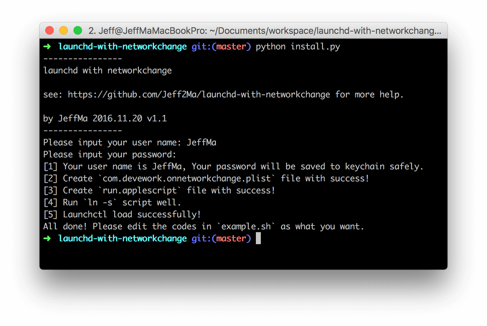
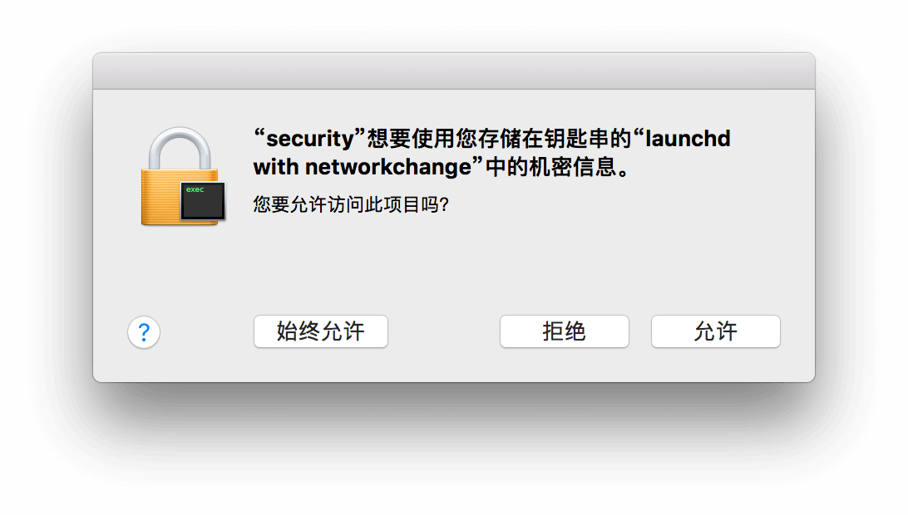

# launchd with networkchange

一个借助`launchd` 实现Mac 系统中网络变化时自动触发并运行指定脚本的工具。

## 介绍

本项目旨在通过自动化的方式解决如下场景:

> 在工作的时候，你的Mac 设备（特指MacBook、MacBook Air 或MacBook Pro）需要进行一些特殊的环境设置（比如修改代理地址，设置特殊的PAC 文件，需要专门打开某些应用，甚至是默认设备静音）。当下班回到家的时候，这些网络设置需要重新改变以适应你的家庭网络。然而第二天上班又要再次修改，如此往往复复。

借助Mac 中的`launchd`（一个类似 crontab 的执行定时任务的东西），我们可以通过监控网络的变化（对于上面的场景具体而言是监控SSID 的变化）来自动触发运行指定脚本。本项目即是这么一个帮你快速配置这个`launchd`服务的一个工具。

**相关文章**：《[高效 Mac 人士必备：实现工作/家庭间网络环境切换的自动化](http://devework.com/mac-automatic-network.html)》

## 原理

在Mac 上，当网络有变化的时候(如关闭/开启WiFi，连接到不同SSID 等)，`/Library/Preferences/SystemConfiguration/com.apple.airport.preferences.plist`这个文件就会有变化。因此借助`launchd`服务中的`WatchPaths`特征，就可以实现监控到文件变化的时候执行指定的脚本文件。

## 特色

本工具具有如下特色：

- 快速帮你进行配置`launchd`服务，免除繁琐的步骤，同时当你不喜欢的时候可以很方便地卸载。

- 因为涉及到网络变动的操作，所以需要用户权限。本工具会将你的用户密码保存在keychain 中，提高安全性。

- 提供了一个脚本文件(`example.sh`)，里面的代码可以方便按照个人需求进行改写。

## 使用方法

```bash
$ git clone https://github.com/Jeff2Ma/launchd-with-networkchange

$ cd launchd-with-networkchange

$ python install.py
```
按照说明输入用户名及密码。



如上，成功完成后请根据个人实际情况改写`example.sh`的代码。

网络变化的时候shell 文件就会自动运行，运行成功则会右上角提示如下：


## 提示

1) 完成上面的步骤之后，首次自动运行脚本的时候系统会弹窗如下:



请选择“**始终允许**”按钮。

2) 如果需要卸载已经生成的`launchd`服务，执行`python install.py uninstall`即可。

## 自定义代码

以下是一些可能用到的Shell 代码帮助你根据个人实际需求定制运行的Shell 基本文件。

提示：你可以将`example.sh`文件复制一份重命名为`dynamic.sh`，直接在`dynamic.sh`上改写代码，两文件同时存在的时候会优先运行`dynamic.sh`（实现方式在[此处源代码](https://github.com/Jeff2Ma/launchd-with-networkchange/blob/master/_demo/_run.applescript#L23-L29)）。

### 设置PAC 文件路径

```bash
/usr/sbin/networksetup -setautoproxyurl Wi-Fi http://example.com/proxy.pac
```

### 运行或关闭某些APP

本质上是调用 applescript 命令

```bash
osascript <<EOD
    tell application "RTX"
	    run
    end tell
    tell application "Proxifier"
        run
    end tell
    tell application "ShadowsocksX"
        quit
    end tell
EOD
```

### 清空DNS 服务器

```bash
/usr/sbin/networksetup -setdnsservers Wi-Fi Empty
```

### kill 掉某进程

```bash
ps -ef | grep Proxifier | awk '{print $2}' | xargs kill
```

## launchd 常见指令

一些常见指令参考，供个人调式之用：

- 检测plist 文件语法是否正确：

`plutil -lint com.devework.onnetworkchange.plist`

- 查看launchd 任务列表：`launchctl list`

- 查看launchd 任务列表（带过滤）：`launchctl list | grep 'deve'`

- 开启/关闭某项任务（-w选项会将plist文件中无效的key覆盖掉）：

```bash
launchctl load -w ~/Library/LaunchAgents/com.devework.onnetworkchange.plist

launchctl unload ~/Library/LaunchAgents/com.devework.onnetworkchange.plist
```

- 立刻执行某项任务（用于测试）：

`launchctl start com.devework.onnetworkchange`

- 停止执行任务：`launchctl stop com.devework.onnetworkchange`

## 贡献

欢迎通过[Issues](https://github.com/Jeff2Ma/launchd-with-networkchange/issues) 提交bug 或疑问，更欢迎通过[Pull requests](https://github.com/Jeff2Ma/launchd-with-networkchange/pulls) 一起完善代码！